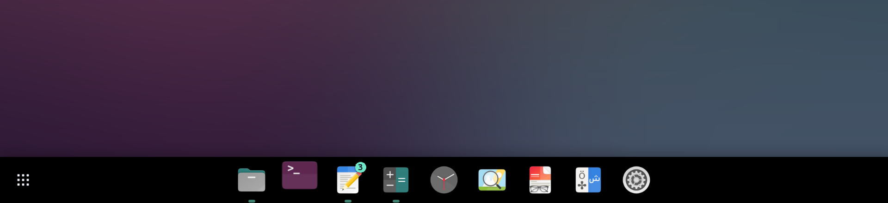
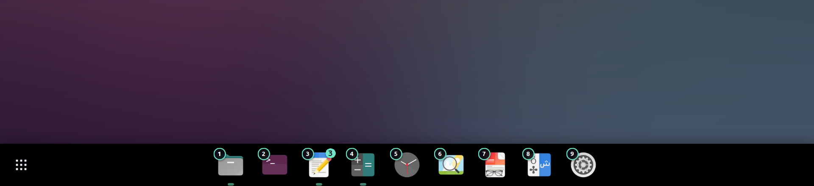

# RicingDock

A dock for GNOME Shell that you rice yourself: a floating island or a
full-width bar, frosted glass, smooth magnification, and every size, color
and gap on a slider. From the maker of RicingTab.






## Features

- **Island or full width**, at the bottom, left or right edge, aligned to the
  start, center or end.
- **Frosted glass**: opacity, blur strength and blur brightness, rounded
  corners, border and shadow.
- **Magnification** of the icon under the pointer, or a macOS-like wave.
  Jitter-free: icons zoom around a fixed point and neighbours slide aside
  (only when the icon would otherwise touch them).
- **The active app stays in post**: its icon keeps a slightly bigger size and
  doesn't react to hover; after a click it settles onto it smoothly.
- **Running indicators** (dots, pill or line), **unread counters and
  progress** reported by apps (Telegram, Thunderbird, browsers), a bounce on
  launch and on new messages.
- **Show Apps button** before or after the icons, or pinned to either end.
- **Drag and drop**: reorder icons, drop a running app among the pinned ones
  to pin it, drop a pinned one on Show Apps to unpin it.
- **Super+number hints**: hold Super to see 1–9 on the pinned icons.
- **Visibility**: always visible (windows keep clear of it), smart hide or
  auto hide.
- **Size**: dock height with top and bottom padding (linked or separate),
  side padding, spacing; animation speed.
- Two ready-made looks, **Dark Mint** and **Dark Glass**.

## Install

From [extensions.gnome.org](https://extensions.gnome.org/) (search for
RicingDock), or with the Extension Manager app.

RicingDock replaces Ubuntu Dock / Dash to Dock. Turn those off, or you will
have two docks:

```
gnome-extensions disable ubuntu-dock@ubuntu.com
```

Manual install from a release zip:

```
gnome-extensions install --force ricingdock@hikikomoriDev.shell-extension.zip
```

then log out and back in (GNOME on Wayland only loads new extensions at
login) and enable it in Extensions.

## Compatibility

GNOME Shell 49 and 50. Every release runs its full test suite on both
(see *Development*).

## Known limits

- The glass blurs the wallpaper, not the windows behind the dock. With the
  dock always visible nothing else is behind it; with auto hide over a window
  you see blurred wallpaper.
- The dock lives on the primary monitor.
- The row doesn't shrink icons when there are more than fit on the screen.

## Development

```
./install.sh --dev        # install through a loader: later runs reload in place
./pack.sh                 # build the zip for extensions.gnome.org into dist/
test/run.sh scenarios/tour.js                  # one scenario, headless GNOME 50
test/podman.sh 49 scenarios/tour.js            # the same on GNOME 49 (Fedora 43)
test/suite.sh 50                               # every scenario on GNOME 50
```

The test bench starts a real GNOME Shell without a screen, with its own
settings, drives a virtual pointer and keyboard, and takes screenshots into
`test/out/`. GNOME 49 runs in a podman container built from
`test/containers/`.

## License

GPL-2.0-or-later. See [LICENSE](LICENSE).
